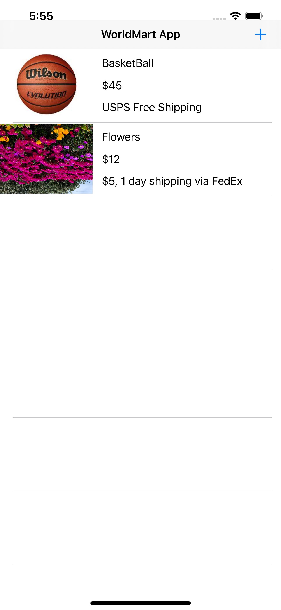
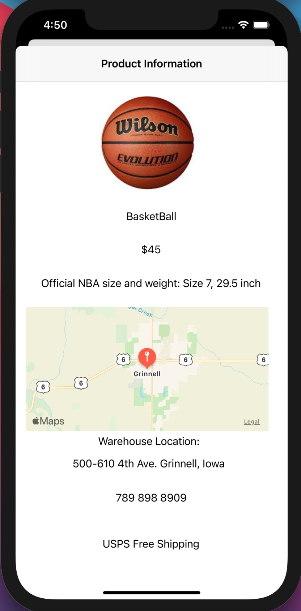
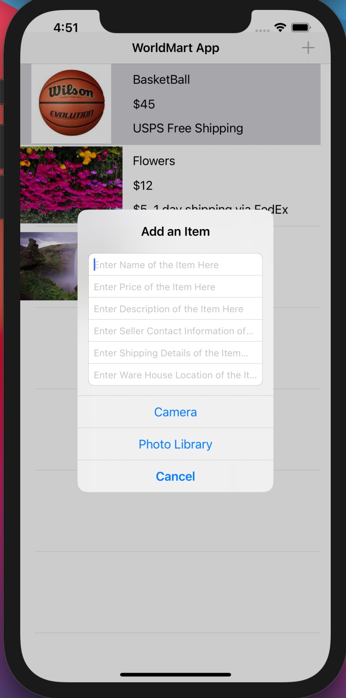

# EcommerceApp-iOSApplication

## Overview

This E-commerce application that provides a comprehensive shopping experience, seamlessly bridging buyers and sellers. With a blend of  Swift, Firebase Storage and Google Maps API, it ensures dynamic product displays, real-time warehouse location visualization, and an elevated user experience.

## Features

1. Dynamic Product Listings
* Items available for sale are displayed in a table view format.
* At a glance, users can view the item's picture, its price, and shipping details.

2.Detailed Product Information
* Upon selecting an item, a detailed page is presented.
* This page showcases the name, price, description, and location of the warehouse.
* Contact information for the seller is readily available for user queries.
3. Warehouse Location Visualization
* A standout feature, this allows users to view a map pinpointing the exact warehouse location.
* This aids B2B customers in tracking transportation costs, estimating potential taxes, and planning out any self-arranged shipping.
4. Add an Item
* A direct and convenient 'Add an Item' functionality is available right from the Home screen.
* Users can effortlessly fill in item details, upload a suitable picture, and have their item listed for sale.

## Technical Stack

* Front-end and Back-end: Firebase & Swift
* Location Visualization: Google Maps API 

## Usage

1. Browse Products: Navigate through the table view and explore available items.
2. View Product Details: Select any item to open its detailed page.
3. Location Insights: Utilize the map view to gauge warehouse location for informed shipping and tax decisions.
4. List an Item: Tap the 'Add an Item' button on the Home screen. Fill in the necessary details and post your item for sale.

## Screenshots

1. Class Diagram

2. MVC Architecture Diagram

3. Home Screen

4. Product View

5. Add View
